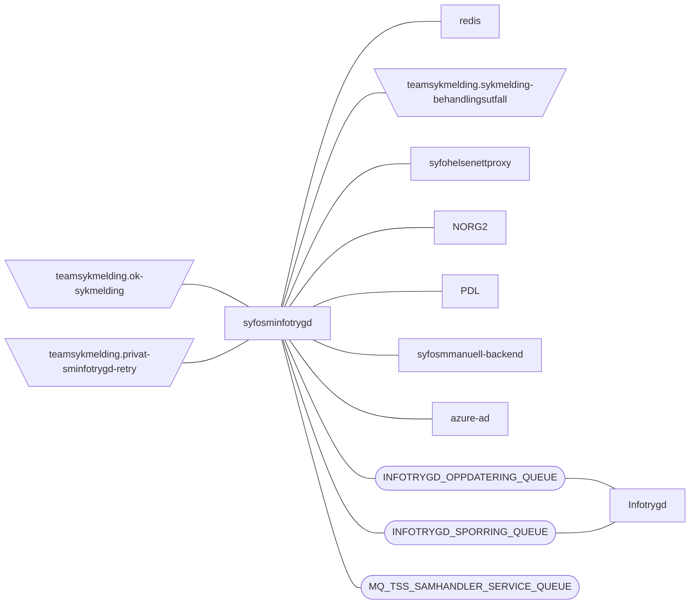

[](https://github.com/navikt/syfosminfotrygd/workflows/Deploy%20to%20dev%20and%20prod/badge.svg)

# SYFO sykmelding infotrygd

Application for handling rules used for infotrygd and later on persisting them in infotrygd or create a manuall task
to persisting them in infotrygd

## FlowChart

This the high level flow of the application



## Technologies used

* Kotlin
* Ktor
* Gradle
* Kotest
* Kafka
* Mq

#### Requirements

* JDK 17
* Docker

## Getting started

### Getting github-package-registry packages NAV-IT

Some packages used in this repo is uploaded to the GitHub Package Registry which requires authentication. It can, for
example, be solved like this in Gradle:

```
val githubUser: String by project
val githubPassword: String by project

repositories {
    maven {
        credentials {
            username = githubUser
            password = githubPassword
        }
        setUrl("https://maven.pkg.github.com/navikt/syfosm-commons")
    }
}
```

`githubUser` and `githubPassword` can be put into a separate file `~/.gradle/gradle.properties` with the following
content:

```                                                     
githubUser=x-access-token
githubPassword=[token]
```

Replace `[token]` with a personal access token with scope `read:packages`.
See githubs
guide [creating-a-personal-access-token](https://docs.github.com/en/authentication/keeping-your-account-and-data-secure/creating-a-personal-access-token)
on
how to create a personal access token.

Alternatively, the variables can be configured via environment variables:

* `ORG_GRADLE_PROJECT_githubUser`
* `ORG_GRADLE_PROJECT_githubPassword`

or the command line:

``` bash
./gradlew -PgithubUser=x-access-token -PgithubPassword=[token]
```

#### Running locally

``` bash
./gradlew run
```

#### Build and run tests

To build locally and run the integration tests you can simply run 
``` bash
./gradlew shadowJar
```
or on windows
`gradlew.bat shadowJar`

#### Creating a docker image

Creating a docker image should be as simple as
``` bash
docker build -t syfosminfotrygd .
```

#### Running a docker image

``` bash
docker run --rm -it -p 8080:8080 syfosminfotrygd
```

### Deploy redis to dev manually:

Deploying redis can be done manually with the following command:
``` bash
kubectl apply --context dev-gcp --namespace teamsykmelding -f redis.yaml
```

### Deploy redis to prod manually:

Deploying redis can be done manually with the following command:
``` bash
kubectl apply --context prod-gcp --namespace teamsykmelding -f redis.yaml
```

### Upgrading the gradle wrapper

Find the newest version of gradle here: https://gradle.org/releases/ 
Then run this command(remeber to 
replace $gradleVersjon with the newest version of gradle):

``` bash
./gradlew wrapper --gradle-version $gradleVersjon
```

### Contact

This project is maintained by [teamsykmelding](CODEOWNERS)

Questions and/or feature requests? Please create an [issue](https://github.com/navikt/syfosminfotrygd/issues)

If you work in [@navikt](https://github.com/navikt) you can reach us at the Slack
channel [#team-sykmelding](https://nav-it.slack.com/archives/CMA3XV997)