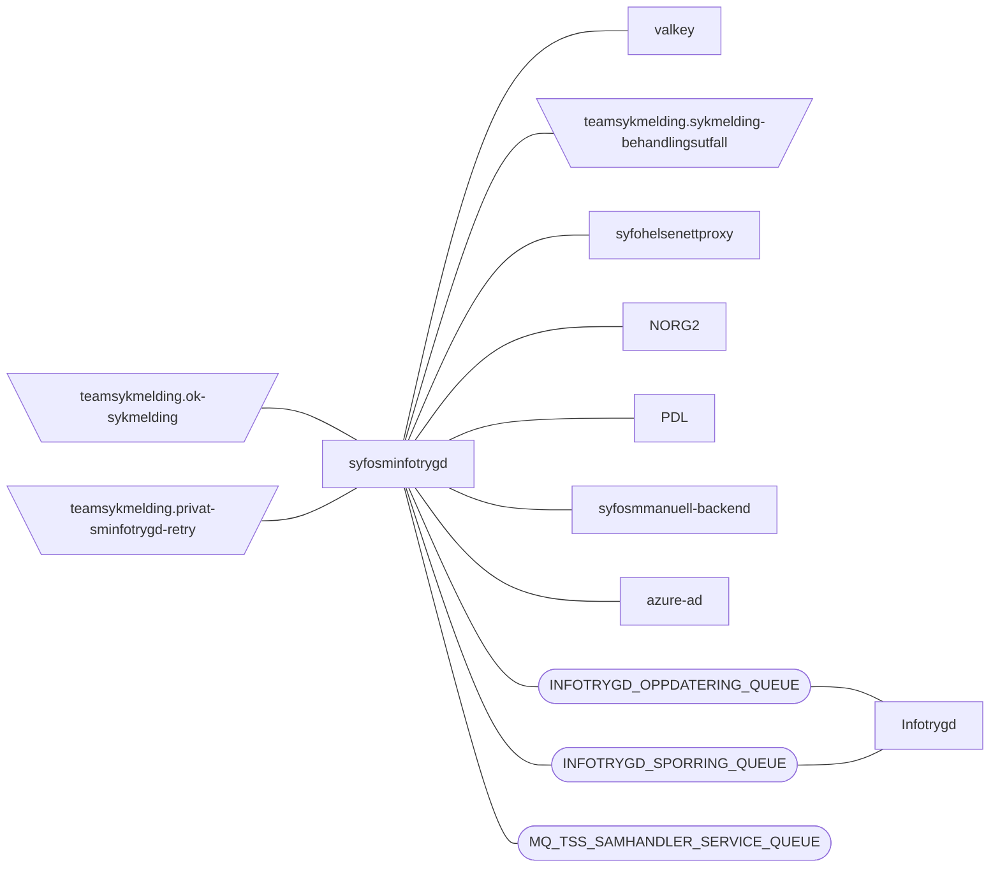
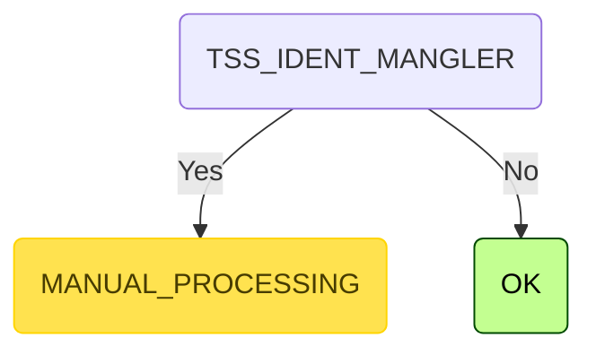

[](https://github.com/navikt/syfosminfotrygd/workflows/Deploy%20to%20dev%20and%20prod/badge.svg)

# SYFO sykmelding infotrygd

Application for handling rules used for infotrygd and later on persisting them in infotrygd or create a manuall task
to persisting them in infotrygd

## FlowChart

This the high level flow of the application



## Technologies used
* Kotlin
* Ktor
* Gradle
* Kotest
* Kafka
* Mq

### Prerequisites
* JDK 21

Make sure you have the Java JDK 21 installed
You can check which version you have installed using this command:
``` bash
java -version
```

* Docker

Make sure you have the Docker installed
You can check which version you have installed using this command:
``` shell
docker -version
```

## Getting started
#### Running locally

``` bash
./gradlew run
```

#### Build and run tests

To build locally and run the integration tests you can simply run 
``` bash
./gradlew shadowJar
```
or on windows
`gradlew.bat shadowJar`

#### Creating a docker image

Creating a docker image should be as simple as running this command
``` bash
docker build -t syfosminfotrygd .
```

#### Running a docker image

``` bash
docker run --rm -it -p 8080:8080 syfosminfotrygd
```

### Upgrading the gradle wrapper

Find the newest version of gradle here: https://gradle.org/releases/ 
Then run this command(remeber to 
replace $gradleVersjon with the newest version of gradle):

``` bash
./gradlew wrapper --gradle-version $gradleVersjon
```

<!-- RULE_MARKER_START -->
Validation
```mermaid
graph TD
    root(NUMBER_OF_TREATMENT_DAYS_SET) -->|Yes| root_NUMBER_OF_TREATMENT_DAYS_SET_MANUAL_PROCESSING(MANUAL_PROCESSING):::manuell
    root(NUMBER_OF_TREATMENT_DAYS_SET) -->|No| root_NUMBER_OF_TREATMENT_DAYS_SET_GRADERT_REISETILSKUDD_ER_OPPGITT(GRADERT_REISETILSKUDD_ER_OPPGITT)
    root_NUMBER_OF_TREATMENT_DAYS_SET_GRADERT_REISETILSKUDD_ER_OPPGITT(GRADERT_REISETILSKUDD_ER_OPPGITT) -->|Yes| root_NUMBER_OF_TREATMENT_DAYS_SET_GRADERT_REISETILSKUDD_ER_OPPGITT_MANUAL_PROCESSING(MANUAL_PROCESSING):::manuell
    root_NUMBER_OF_TREATMENT_DAYS_SET_GRADERT_REISETILSKUDD_ER_OPPGITT(GRADERT_REISETILSKUDD_ER_OPPGITT) -->|No| root_NUMBER_OF_TREATMENT_DAYS_SET_GRADERT_REISETILSKUDD_ER_OPPGITT_TRAVEL_SUBSIDY_SPECIFIED(TRAVEL_SUBSIDY_SPECIFIED)
    root_NUMBER_OF_TREATMENT_DAYS_SET_GRADERT_REISETILSKUDD_ER_OPPGITT_TRAVEL_SUBSIDY_SPECIFIED(TRAVEL_SUBSIDY_SPECIFIED) -->|Yes| root_NUMBER_OF_TREATMENT_DAYS_SET_GRADERT_REISETILSKUDD_ER_OPPGITT_TRAVEL_SUBSIDY_SPECIFIED_MANUAL_PROCESSING(MANUAL_PROCESSING):::manuell
    root_NUMBER_OF_TREATMENT_DAYS_SET_GRADERT_REISETILSKUDD_ER_OPPGITT_TRAVEL_SUBSIDY_SPECIFIED(TRAVEL_SUBSIDY_SPECIFIED) -->|No| root_NUMBER_OF_TREATMENT_DAYS_SET_GRADERT_REISETILSKUDD_ER_OPPGITT_TRAVEL_SUBSIDY_SPECIFIED_PATIENT_NOT_IN_IP(PATIENT_NOT_IN_IP)
    root_NUMBER_OF_TREATMENT_DAYS_SET_GRADERT_REISETILSKUDD_ER_OPPGITT_TRAVEL_SUBSIDY_SPECIFIED_PATIENT_NOT_IN_IP(PATIENT_NOT_IN_IP) -->|Yes| root_NUMBER_OF_TREATMENT_DAYS_SET_GRADERT_REISETILSKUDD_ER_OPPGITT_TRAVEL_SUBSIDY_SPECIFIED_PATIENT_NOT_IN_IP_MANUAL_PROCESSING(MANUAL_PROCESSING):::manuell
    root_NUMBER_OF_TREATMENT_DAYS_SET_GRADERT_REISETILSKUDD_ER_OPPGITT_TRAVEL_SUBSIDY_SPECIFIED_PATIENT_NOT_IN_IP(PATIENT_NOT_IN_IP) -->|No| root_NUMBER_OF_TREATMENT_DAYS_SET_GRADERT_REISETILSKUDD_ER_OPPGITT_TRAVEL_SUBSIDY_SPECIFIED_PATIENT_NOT_IN_IP_PARTIALLY_COINCIDENT_SICK_LEAVE_PERIOD_WITH_PREVIOUSLY_REGISTERED_SICK_LEAVE(PARTIALLY_COINCIDENT_SICK_LEAVE_PERIOD_WITH_PREVIOUSLY_REGISTERED_SICK_LEAVE)
    root_NUMBER_OF_TREATMENT_DAYS_SET_GRADERT_REISETILSKUDD_ER_OPPGITT_TRAVEL_SUBSIDY_SPECIFIED_PATIENT_NOT_IN_IP_PARTIALLY_COINCIDENT_SICK_LEAVE_PERIOD_WITH_PREVIOUSLY_REGISTERED_SICK_LEAVE(PARTIALLY_COINCIDENT_SICK_LEAVE_PERIOD_WITH_PREVIOUSLY_REGISTERED_SICK_LEAVE) -->|Yes| root_NUMBER_OF_TREATMENT_DAYS_SET_GRADERT_REISETILSKUDD_ER_OPPGITT_TRAVEL_SUBSIDY_SPECIFIED_PATIENT_NOT_IN_IP_PARTIALLY_COINCIDENT_SICK_LEAVE_PERIOD_WITH_PREVIOUSLY_REGISTERED_SICK_LEAVE_MANUAL_PROCESSING(MANUAL_PROCESSING):::manuell
    root_NUMBER_OF_TREATMENT_DAYS_SET_GRADERT_REISETILSKUDD_ER_OPPGITT_TRAVEL_SUBSIDY_SPECIFIED_PATIENT_NOT_IN_IP_PARTIALLY_COINCIDENT_SICK_LEAVE_PERIOD_WITH_PREVIOUSLY_REGISTERED_SICK_LEAVE(PARTIALLY_COINCIDENT_SICK_LEAVE_PERIOD_WITH_PREVIOUSLY_REGISTERED_SICK_LEAVE) -->|No| root_NUMBER_OF_TREATMENT_DAYS_SET_GRADERT_REISETILSKUDD_ER_OPPGITT_TRAVEL_SUBSIDY_SPECIFIED_PATIENT_NOT_IN_IP_PARTIALLY_COINCIDENT_SICK_LEAVE_PERIOD_WITH_PREVIOUSLY_REGISTERED_SICK_LEAVE_SICKLEAVE_EXTENTION_FROM_DIFFRENT_NAV_OFFICE_1(SICKLEAVE_EXTENTION_FROM_DIFFRENT_NAV_OFFICE_1)
    root_NUMBER_OF_TREATMENT_DAYS_SET_GRADERT_REISETILSKUDD_ER_OPPGITT_TRAVEL_SUBSIDY_SPECIFIED_PATIENT_NOT_IN_IP_PARTIALLY_COINCIDENT_SICK_LEAVE_PERIOD_WITH_PREVIOUSLY_REGISTERED_SICK_LEAVE_SICKLEAVE_EXTENTION_FROM_DIFFRENT_NAV_OFFICE_1(SICKLEAVE_EXTENTION_FROM_DIFFRENT_NAV_OFFICE_1) -->|Yes| root_NUMBER_OF_TREATMENT_DAYS_SET_GRADERT_REISETILSKUDD_ER_OPPGITT_TRAVEL_SUBSIDY_SPECIFIED_PATIENT_NOT_IN_IP_PARTIALLY_COINCIDENT_SICK_LEAVE_PERIOD_WITH_PREVIOUSLY_REGISTERED_SICK_LEAVE_SICKLEAVE_EXTENTION_FROM_DIFFRENT_NAV_OFFICE_1_MANUAL_PROCESSING(MANUAL_PROCESSING):::manuell
    root_NUMBER_OF_TREATMENT_DAYS_SET_GRADERT_REISETILSKUDD_ER_OPPGITT_TRAVEL_SUBSIDY_SPECIFIED_PATIENT_NOT_IN_IP_PARTIALLY_COINCIDENT_SICK_LEAVE_PERIOD_WITH_PREVIOUSLY_REGISTERED_SICK_LEAVE_SICKLEAVE_EXTENTION_FROM_DIFFRENT_NAV_OFFICE_1(SICKLEAVE_EXTENTION_FROM_DIFFRENT_NAV_OFFICE_1) -->|No| root_NUMBER_OF_TREATMENT_DAYS_SET_GRADERT_REISETILSKUDD_ER_OPPGITT_TRAVEL_SUBSIDY_SPECIFIED_PATIENT_NOT_IN_IP_PARTIALLY_COINCIDENT_SICK_LEAVE_PERIOD_WITH_PREVIOUSLY_REGISTERED_SICK_LEAVE_SICKLEAVE_EXTENTION_FROM_DIFFRENT_NAV_OFFICE_1_SICKLEAVE_EXTENTION_FROM_DIFFRENT_NAV_OFFICE_2(SICKLEAVE_EXTENTION_FROM_DIFFRENT_NAV_OFFICE_2)
    root_NUMBER_OF_TREATMENT_DAYS_SET_GRADERT_REISETILSKUDD_ER_OPPGITT_TRAVEL_SUBSIDY_SPECIFIED_PATIENT_NOT_IN_IP_PARTIALLY_COINCIDENT_SICK_LEAVE_PERIOD_WITH_PREVIOUSLY_REGISTERED_SICK_LEAVE_SICKLEAVE_EXTENTION_FROM_DIFFRENT_NAV_OFFICE_1_SICKLEAVE_EXTENTION_FROM_DIFFRENT_NAV_OFFICE_2(SICKLEAVE_EXTENTION_FROM_DIFFRENT_NAV_OFFICE_2) -->|Yes| root_NUMBER_OF_TREATMENT_DAYS_SET_GRADERT_REISETILSKUDD_ER_OPPGITT_TRAVEL_SUBSIDY_SPECIFIED_PATIENT_NOT_IN_IP_PARTIALLY_COINCIDENT_SICK_LEAVE_PERIOD_WITH_PREVIOUSLY_REGISTERED_SICK_LEAVE_SICKLEAVE_EXTENTION_FROM_DIFFRENT_NAV_OFFICE_1_SICKLEAVE_EXTENTION_FROM_DIFFRENT_NAV_OFFICE_2_MANUAL_PROCESSING(MANUAL_PROCESSING):::manuell
    root_NUMBER_OF_TREATMENT_DAYS_SET_GRADERT_REISETILSKUDD_ER_OPPGITT_TRAVEL_SUBSIDY_SPECIFIED_PATIENT_NOT_IN_IP_PARTIALLY_COINCIDENT_SICK_LEAVE_PERIOD_WITH_PREVIOUSLY_REGISTERED_SICK_LEAVE_SICKLEAVE_EXTENTION_FROM_DIFFRENT_NAV_OFFICE_1_SICKLEAVE_EXTENTION_FROM_DIFFRENT_NAV_OFFICE_2(SICKLEAVE_EXTENTION_FROM_DIFFRENT_NAV_OFFICE_2) -->|No| root_NUMBER_OF_TREATMENT_DAYS_SET_GRADERT_REISETILSKUDD_ER_OPPGITT_TRAVEL_SUBSIDY_SPECIFIED_PATIENT_NOT_IN_IP_PARTIALLY_COINCIDENT_SICK_LEAVE_PERIOD_WITH_PREVIOUSLY_REGISTERED_SICK_LEAVE_SICKLEAVE_EXTENTION_FROM_DIFFRENT_NAV_OFFICE_1_SICKLEAVE_EXTENTION_FROM_DIFFRENT_NAV_OFFICE_2_SICKLEAVE_EXTENTION_FROM_DIFFRENT_NAV_OFFICE_3(SICKLEAVE_EXTENTION_FROM_DIFFRENT_NAV_OFFICE_3)
    root_NUMBER_OF_TREATMENT_DAYS_SET_GRADERT_REISETILSKUDD_ER_OPPGITT_TRAVEL_SUBSIDY_SPECIFIED_PATIENT_NOT_IN_IP_PARTIALLY_COINCIDENT_SICK_LEAVE_PERIOD_WITH_PREVIOUSLY_REGISTERED_SICK_LEAVE_SICKLEAVE_EXTENTION_FROM_DIFFRENT_NAV_OFFICE_1_SICKLEAVE_EXTENTION_FROM_DIFFRENT_NAV_OFFICE_2_SICKLEAVE_EXTENTION_FROM_DIFFRENT_NAV_OFFICE_3(SICKLEAVE_EXTENTION_FROM_DIFFRENT_NAV_OFFICE_3) -->|Yes| root_NUMBER_OF_TREATMENT_DAYS_SET_GRADERT_REISETILSKUDD_ER_OPPGITT_TRAVEL_SUBSIDY_SPECIFIED_PATIENT_NOT_IN_IP_PARTIALLY_COINCIDENT_SICK_LEAVE_PERIOD_WITH_PREVIOUSLY_REGISTERED_SICK_LEAVE_SICKLEAVE_EXTENTION_FROM_DIFFRENT_NAV_OFFICE_1_SICKLEAVE_EXTENTION_FROM_DIFFRENT_NAV_OFFICE_2_SICKLEAVE_EXTENTION_FROM_DIFFRENT_NAV_OFFICE_3_MANUAL_PROCESSING(MANUAL_PROCESSING):::manuell
    root_NUMBER_OF_TREATMENT_DAYS_SET_GRADERT_REISETILSKUDD_ER_OPPGITT_TRAVEL_SUBSIDY_SPECIFIED_PATIENT_NOT_IN_IP_PARTIALLY_COINCIDENT_SICK_LEAVE_PERIOD_WITH_PREVIOUSLY_REGISTERED_SICK_LEAVE_SICKLEAVE_EXTENTION_FROM_DIFFRENT_NAV_OFFICE_1_SICKLEAVE_EXTENTION_FROM_DIFFRENT_NAV_OFFICE_2_SICKLEAVE_EXTENTION_FROM_DIFFRENT_NAV_OFFICE_3(SICKLEAVE_EXTENTION_FROM_DIFFRENT_NAV_OFFICE_3) -->|No| root_NUMBER_OF_TREATMENT_DAYS_SET_GRADERT_REISETILSKUDD_ER_OPPGITT_TRAVEL_SUBSIDY_SPECIFIED_PATIENT_NOT_IN_IP_PARTIALLY_COINCIDENT_SICK_LEAVE_PERIOD_WITH_PREVIOUSLY_REGISTERED_SICK_LEAVE_SICKLEAVE_EXTENTION_FROM_DIFFRENT_NAV_OFFICE_1_SICKLEAVE_EXTENTION_FROM_DIFFRENT_NAV_OFFICE_2_SICKLEAVE_EXTENTION_FROM_DIFFRENT_NAV_OFFICE_3_NEW_CLEAN_BILL_DATE_BEFORE_PAYOUT(NEW_CLEAN_BILL_DATE_BEFORE_PAYOUT)
    root_NUMBER_OF_TREATMENT_DAYS_SET_GRADERT_REISETILSKUDD_ER_OPPGITT_TRAVEL_SUBSIDY_SPECIFIED_PATIENT_NOT_IN_IP_PARTIALLY_COINCIDENT_SICK_LEAVE_PERIOD_WITH_PREVIOUSLY_REGISTERED_SICK_LEAVE_SICKLEAVE_EXTENTION_FROM_DIFFRENT_NAV_OFFICE_1_SICKLEAVE_EXTENTION_FROM_DIFFRENT_NAV_OFFICE_2_SICKLEAVE_EXTENTION_FROM_DIFFRENT_NAV_OFFICE_3_NEW_CLEAN_BILL_DATE_BEFORE_PAYOUT(NEW_CLEAN_BILL_DATE_BEFORE_PAYOUT) -->|Yes| root_NUMBER_OF_TREATMENT_DAYS_SET_GRADERT_REISETILSKUDD_ER_OPPGITT_TRAVEL_SUBSIDY_SPECIFIED_PATIENT_NOT_IN_IP_PARTIALLY_COINCIDENT_SICK_LEAVE_PERIOD_WITH_PREVIOUSLY_REGISTERED_SICK_LEAVE_SICKLEAVE_EXTENTION_FROM_DIFFRENT_NAV_OFFICE_1_SICKLEAVE_EXTENTION_FROM_DIFFRENT_NAV_OFFICE_2_SICKLEAVE_EXTENTION_FROM_DIFFRENT_NAV_OFFICE_3_NEW_CLEAN_BILL_DATE_BEFORE_PAYOUT_MANUAL_PROCESSING(MANUAL_PROCESSING):::manuell
    root_NUMBER_OF_TREATMENT_DAYS_SET_GRADERT_REISETILSKUDD_ER_OPPGITT_TRAVEL_SUBSIDY_SPECIFIED_PATIENT_NOT_IN_IP_PARTIALLY_COINCIDENT_SICK_LEAVE_PERIOD_WITH_PREVIOUSLY_REGISTERED_SICK_LEAVE_SICKLEAVE_EXTENTION_FROM_DIFFRENT_NAV_OFFICE_1_SICKLEAVE_EXTENTION_FROM_DIFFRENT_NAV_OFFICE_2_SICKLEAVE_EXTENTION_FROM_DIFFRENT_NAV_OFFICE_3_NEW_CLEAN_BILL_DATE_BEFORE_PAYOUT(NEW_CLEAN_BILL_DATE_BEFORE_PAYOUT) -->|No| root_NUMBER_OF_TREATMENT_DAYS_SET_GRADERT_REISETILSKUDD_ER_OPPGITT_TRAVEL_SUBSIDY_SPECIFIED_PATIENT_NOT_IN_IP_PARTIALLY_COINCIDENT_SICK_LEAVE_PERIOD_WITH_PREVIOUSLY_REGISTERED_SICK_LEAVE_SICKLEAVE_EXTENTION_FROM_DIFFRENT_NAV_OFFICE_1_SICKLEAVE_EXTENTION_FROM_DIFFRENT_NAV_OFFICE_2_SICKLEAVE_EXTENTION_FROM_DIFFRENT_NAV_OFFICE_3_NEW_CLEAN_BILL_DATE_BEFORE_PAYOUT_NEW_CLEAN_BILL_DATE_BEFORE_REGISTERD_CLEAN_BILL_DATE(NEW_CLEAN_BILL_DATE_BEFORE_REGISTERD_CLEAN_BILL_DATE)
    root_NUMBER_OF_TREATMENT_DAYS_SET_GRADERT_REISETILSKUDD_ER_OPPGITT_TRAVEL_SUBSIDY_SPECIFIED_PATIENT_NOT_IN_IP_PARTIALLY_COINCIDENT_SICK_LEAVE_PERIOD_WITH_PREVIOUSLY_REGISTERED_SICK_LEAVE_SICKLEAVE_EXTENTION_FROM_DIFFRENT_NAV_OFFICE_1_SICKLEAVE_EXTENTION_FROM_DIFFRENT_NAV_OFFICE_2_SICKLEAVE_EXTENTION_FROM_DIFFRENT_NAV_OFFICE_3_NEW_CLEAN_BILL_DATE_BEFORE_PAYOUT_NEW_CLEAN_BILL_DATE_BEFORE_REGISTERD_CLEAN_BILL_DATE(NEW_CLEAN_BILL_DATE_BEFORE_REGISTERD_CLEAN_BILL_DATE) -->|Yes| root_NUMBER_OF_TREATMENT_DAYS_SET_GRADERT_REISETILSKUDD_ER_OPPGITT_TRAVEL_SUBSIDY_SPECIFIED_PATIENT_NOT_IN_IP_PARTIALLY_COINCIDENT_SICK_LEAVE_PERIOD_WITH_PREVIOUSLY_REGISTERED_SICK_LEAVE_SICKLEAVE_EXTENTION_FROM_DIFFRENT_NAV_OFFICE_1_SICKLEAVE_EXTENTION_FROM_DIFFRENT_NAV_OFFICE_2_SICKLEAVE_EXTENTION_FROM_DIFFRENT_NAV_OFFICE_3_NEW_CLEAN_BILL_DATE_BEFORE_PAYOUT_NEW_CLEAN_BILL_DATE_BEFORE_REGISTERD_CLEAN_BILL_DATE_MANUAL_PROCESSING(MANUAL_PROCESSING):::manuell
    root_NUMBER_OF_TREATMENT_DAYS_SET_GRADERT_REISETILSKUDD_ER_OPPGITT_TRAVEL_SUBSIDY_SPECIFIED_PATIENT_NOT_IN_IP_PARTIALLY_COINCIDENT_SICK_LEAVE_PERIOD_WITH_PREVIOUSLY_REGISTERED_SICK_LEAVE_SICKLEAVE_EXTENTION_FROM_DIFFRENT_NAV_OFFICE_1_SICKLEAVE_EXTENTION_FROM_DIFFRENT_NAV_OFFICE_2_SICKLEAVE_EXTENTION_FROM_DIFFRENT_NAV_OFFICE_3_NEW_CLEAN_BILL_DATE_BEFORE_PAYOUT_NEW_CLEAN_BILL_DATE_BEFORE_REGISTERD_CLEAN_BILL_DATE(NEW_CLEAN_BILL_DATE_BEFORE_REGISTERD_CLEAN_BILL_DATE) -->|No| root_NUMBER_OF_TREATMENT_DAYS_SET_GRADERT_REISETILSKUDD_ER_OPPGITT_TRAVEL_SUBSIDY_SPECIFIED_PATIENT_NOT_IN_IP_PARTIALLY_COINCIDENT_SICK_LEAVE_PERIOD_WITH_PREVIOUSLY_REGISTERED_SICK_LEAVE_SICKLEAVE_EXTENTION_FROM_DIFFRENT_NAV_OFFICE_1_SICKLEAVE_EXTENTION_FROM_DIFFRENT_NAV_OFFICE_2_SICKLEAVE_EXTENTION_FROM_DIFFRENT_NAV_OFFICE_3_NEW_CLEAN_BILL_DATE_BEFORE_PAYOUT_NEW_CLEAN_BILL_DATE_BEFORE_REGISTERD_CLEAN_BILL_DATE_EXTANION_OVER_FA(EXTANION_OVER_FA)
    root_NUMBER_OF_TREATMENT_DAYS_SET_GRADERT_REISETILSKUDD_ER_OPPGITT_TRAVEL_SUBSIDY_SPECIFIED_PATIENT_NOT_IN_IP_PARTIALLY_COINCIDENT_SICK_LEAVE_PERIOD_WITH_PREVIOUSLY_REGISTERED_SICK_LEAVE_SICKLEAVE_EXTENTION_FROM_DIFFRENT_NAV_OFFICE_1_SICKLEAVE_EXTENTION_FROM_DIFFRENT_NAV_OFFICE_2_SICKLEAVE_EXTENTION_FROM_DIFFRENT_NAV_OFFICE_3_NEW_CLEAN_BILL_DATE_BEFORE_PAYOUT_NEW_CLEAN_BILL_DATE_BEFORE_REGISTERD_CLEAN_BILL_DATE_EXTANION_OVER_FA(EXTANION_OVER_FA) -->|Yes| root_NUMBER_OF_TREATMENT_DAYS_SET_GRADERT_REISETILSKUDD_ER_OPPGITT_TRAVEL_SUBSIDY_SPECIFIED_PATIENT_NOT_IN_IP_PARTIALLY_COINCIDENT_SICK_LEAVE_PERIOD_WITH_PREVIOUSLY_REGISTERED_SICK_LEAVE_SICKLEAVE_EXTENTION_FROM_DIFFRENT_NAV_OFFICE_1_SICKLEAVE_EXTENTION_FROM_DIFFRENT_NAV_OFFICE_2_SICKLEAVE_EXTENTION_FROM_DIFFRENT_NAV_OFFICE_3_NEW_CLEAN_BILL_DATE_BEFORE_PAYOUT_NEW_CLEAN_BILL_DATE_BEFORE_REGISTERD_CLEAN_BILL_DATE_EXTANION_OVER_FA_MANUAL_PROCESSING(MANUAL_PROCESSING):::manuell
    root_NUMBER_OF_TREATMENT_DAYS_SET_GRADERT_REISETILSKUDD_ER_OPPGITT_TRAVEL_SUBSIDY_SPECIFIED_PATIENT_NOT_IN_IP_PARTIALLY_COINCIDENT_SICK_LEAVE_PERIOD_WITH_PREVIOUSLY_REGISTERED_SICK_LEAVE_SICKLEAVE_EXTENTION_FROM_DIFFRENT_NAV_OFFICE_1_SICKLEAVE_EXTENTION_FROM_DIFFRENT_NAV_OFFICE_2_SICKLEAVE_EXTENTION_FROM_DIFFRENT_NAV_OFFICE_3_NEW_CLEAN_BILL_DATE_BEFORE_PAYOUT_NEW_CLEAN_BILL_DATE_BEFORE_REGISTERD_CLEAN_BILL_DATE_EXTANION_OVER_FA(EXTANION_OVER_FA) -->|No| root_NUMBER_OF_TREATMENT_DAYS_SET_GRADERT_REISETILSKUDD_ER_OPPGITT_TRAVEL_SUBSIDY_SPECIFIED_PATIENT_NOT_IN_IP_PARTIALLY_COINCIDENT_SICK_LEAVE_PERIOD_WITH_PREVIOUSLY_REGISTERED_SICK_LEAVE_SICKLEAVE_EXTENTION_FROM_DIFFRENT_NAV_OFFICE_1_SICKLEAVE_EXTENTION_FROM_DIFFRENT_NAV_OFFICE_2_SICKLEAVE_EXTENTION_FROM_DIFFRENT_NAV_OFFICE_3_NEW_CLEAN_BILL_DATE_BEFORE_PAYOUT_NEW_CLEAN_BILL_DATE_BEFORE_REGISTERD_CLEAN_BILL_DATE_EXTANION_OVER_FA_PERSON_MOVING_KODE_FL(PERSON_MOVING_KODE_FL)
    root_NUMBER_OF_TREATMENT_DAYS_SET_GRADERT_REISETILSKUDD_ER_OPPGITT_TRAVEL_SUBSIDY_SPECIFIED_PATIENT_NOT_IN_IP_PARTIALLY_COINCIDENT_SICK_LEAVE_PERIOD_WITH_PREVIOUSLY_REGISTERED_SICK_LEAVE_SICKLEAVE_EXTENTION_FROM_DIFFRENT_NAV_OFFICE_1_SICKLEAVE_EXTENTION_FROM_DIFFRENT_NAV_OFFICE_2_SICKLEAVE_EXTENTION_FROM_DIFFRENT_NAV_OFFICE_3_NEW_CLEAN_BILL_DATE_BEFORE_PAYOUT_NEW_CLEAN_BILL_DATE_BEFORE_REGISTERD_CLEAN_BILL_DATE_EXTANION_OVER_FA_PERSON_MOVING_KODE_FL(PERSON_MOVING_KODE_FL) -->|Yes| root_NUMBER_OF_TREATMENT_DAYS_SET_GRADERT_REISETILSKUDD_ER_OPPGITT_TRAVEL_SUBSIDY_SPECIFIED_PATIENT_NOT_IN_IP_PARTIALLY_COINCIDENT_SICK_LEAVE_PERIOD_WITH_PREVIOUSLY_REGISTERED_SICK_LEAVE_SICKLEAVE_EXTENTION_FROM_DIFFRENT_NAV_OFFICE_1_SICKLEAVE_EXTENTION_FROM_DIFFRENT_NAV_OFFICE_2_SICKLEAVE_EXTENTION_FROM_DIFFRENT_NAV_OFFICE_3_NEW_CLEAN_BILL_DATE_BEFORE_PAYOUT_NEW_CLEAN_BILL_DATE_BEFORE_REGISTERD_CLEAN_BILL_DATE_EXTANION_OVER_FA_PERSON_MOVING_KODE_FL_MANUAL_PROCESSING(MANUAL_PROCESSING):::manuell
    root_NUMBER_OF_TREATMENT_DAYS_SET_GRADERT_REISETILSKUDD_ER_OPPGITT_TRAVEL_SUBSIDY_SPECIFIED_PATIENT_NOT_IN_IP_PARTIALLY_COINCIDENT_SICK_LEAVE_PERIOD_WITH_PREVIOUSLY_REGISTERED_SICK_LEAVE_SICKLEAVE_EXTENTION_FROM_DIFFRENT_NAV_OFFICE_1_SICKLEAVE_EXTENTION_FROM_DIFFRENT_NAV_OFFICE_2_SICKLEAVE_EXTENTION_FROM_DIFFRENT_NAV_OFFICE_3_NEW_CLEAN_BILL_DATE_BEFORE_PAYOUT_NEW_CLEAN_BILL_DATE_BEFORE_REGISTERD_CLEAN_BILL_DATE_EXTANION_OVER_FA_PERSON_MOVING_KODE_FL(PERSON_MOVING_KODE_FL) -->|No| root_NUMBER_OF_TREATMENT_DAYS_SET_GRADERT_REISETILSKUDD_ER_OPPGITT_TRAVEL_SUBSIDY_SPECIFIED_PATIENT_NOT_IN_IP_PARTIALLY_COINCIDENT_SICK_LEAVE_PERIOD_WITH_PREVIOUSLY_REGISTERED_SICK_LEAVE_SICKLEAVE_EXTENTION_FROM_DIFFRENT_NAV_OFFICE_1_SICKLEAVE_EXTENTION_FROM_DIFFRENT_NAV_OFFICE_2_SICKLEAVE_EXTENTION_FROM_DIFFRENT_NAV_OFFICE_3_NEW_CLEAN_BILL_DATE_BEFORE_PAYOUT_NEW_CLEAN_BILL_DATE_BEFORE_REGISTERD_CLEAN_BILL_DATE_EXTANION_OVER_FA_PERSON_MOVING_KODE_FL_PERIOD_FOR_AA_ENDED(PERIOD_FOR_AA_ENDED)
    root_NUMBER_OF_TREATMENT_DAYS_SET_GRADERT_REISETILSKUDD_ER_OPPGITT_TRAVEL_SUBSIDY_SPECIFIED_PATIENT_NOT_IN_IP_PARTIALLY_COINCIDENT_SICK_LEAVE_PERIOD_WITH_PREVIOUSLY_REGISTERED_SICK_LEAVE_SICKLEAVE_EXTENTION_FROM_DIFFRENT_NAV_OFFICE_1_SICKLEAVE_EXTENTION_FROM_DIFFRENT_NAV_OFFICE_2_SICKLEAVE_EXTENTION_FROM_DIFFRENT_NAV_OFFICE_3_NEW_CLEAN_BILL_DATE_BEFORE_PAYOUT_NEW_CLEAN_BILL_DATE_BEFORE_REGISTERD_CLEAN_BILL_DATE_EXTANION_OVER_FA_PERSON_MOVING_KODE_FL_PERIOD_FOR_AA_ENDED(PERIOD_FOR_AA_ENDED) -->|Yes| root_NUMBER_OF_TREATMENT_DAYS_SET_GRADERT_REISETILSKUDD_ER_OPPGITT_TRAVEL_SUBSIDY_SPECIFIED_PATIENT_NOT_IN_IP_PARTIALLY_COINCIDENT_SICK_LEAVE_PERIOD_WITH_PREVIOUSLY_REGISTERED_SICK_LEAVE_SICKLEAVE_EXTENTION_FROM_DIFFRENT_NAV_OFFICE_1_SICKLEAVE_EXTENTION_FROM_DIFFRENT_NAV_OFFICE_2_SICKLEAVE_EXTENTION_FROM_DIFFRENT_NAV_OFFICE_3_NEW_CLEAN_BILL_DATE_BEFORE_PAYOUT_NEW_CLEAN_BILL_DATE_BEFORE_REGISTERD_CLEAN_BILL_DATE_EXTANION_OVER_FA_PERSON_MOVING_KODE_FL_PERIOD_FOR_AA_ENDED_MANUAL_PROCESSING(MANUAL_PROCESSING):::manuell
    root_NUMBER_OF_TREATMENT_DAYS_SET_GRADERT_REISETILSKUDD_ER_OPPGITT_TRAVEL_SUBSIDY_SPECIFIED_PATIENT_NOT_IN_IP_PARTIALLY_COINCIDENT_SICK_LEAVE_PERIOD_WITH_PREVIOUSLY_REGISTERED_SICK_LEAVE_SICKLEAVE_EXTENTION_FROM_DIFFRENT_NAV_OFFICE_1_SICKLEAVE_EXTENTION_FROM_DIFFRENT_NAV_OFFICE_2_SICKLEAVE_EXTENTION_FROM_DIFFRENT_NAV_OFFICE_3_NEW_CLEAN_BILL_DATE_BEFORE_PAYOUT_NEW_CLEAN_BILL_DATE_BEFORE_REGISTERD_CLEAN_BILL_DATE_EXTANION_OVER_FA_PERSON_MOVING_KODE_FL_PERIOD_FOR_AA_ENDED(PERIOD_FOR_AA_ENDED) -->|No| root_NUMBER_OF_TREATMENT_DAYS_SET_GRADERT_REISETILSKUDD_ER_OPPGITT_TRAVEL_SUBSIDY_SPECIFIED_PATIENT_NOT_IN_IP_PARTIALLY_COINCIDENT_SICK_LEAVE_PERIOD_WITH_PREVIOUSLY_REGISTERED_SICK_LEAVE_SICKLEAVE_EXTENTION_FROM_DIFFRENT_NAV_OFFICE_1_SICKLEAVE_EXTENTION_FROM_DIFFRENT_NAV_OFFICE_2_SICKLEAVE_EXTENTION_FROM_DIFFRENT_NAV_OFFICE_3_NEW_CLEAN_BILL_DATE_BEFORE_PAYOUT_NEW_CLEAN_BILL_DATE_BEFORE_REGISTERD_CLEAN_BILL_DATE_EXTANION_OVER_FA_PERSON_MOVING_KODE_FL_PERIOD_FOR_AA_ENDED_PERIOD_IS_AF(PERIOD_IS_AF)
    root_NUMBER_OF_TREATMENT_DAYS_SET_GRADERT_REISETILSKUDD_ER_OPPGITT_TRAVEL_SUBSIDY_SPECIFIED_PATIENT_NOT_IN_IP_PARTIALLY_COINCIDENT_SICK_LEAVE_PERIOD_WITH_PREVIOUSLY_REGISTERED_SICK_LEAVE_SICKLEAVE_EXTENTION_FROM_DIFFRENT_NAV_OFFICE_1_SICKLEAVE_EXTENTION_FROM_DIFFRENT_NAV_OFFICE_2_SICKLEAVE_EXTENTION_FROM_DIFFRENT_NAV_OFFICE_3_NEW_CLEAN_BILL_DATE_BEFORE_PAYOUT_NEW_CLEAN_BILL_DATE_BEFORE_REGISTERD_CLEAN_BILL_DATE_EXTANION_OVER_FA_PERSON_MOVING_KODE_FL_PERIOD_FOR_AA_ENDED_PERIOD_IS_AF(PERIOD_IS_AF) -->|Yes| root_NUMBER_OF_TREATMENT_DAYS_SET_GRADERT_REISETILSKUDD_ER_OPPGITT_TRAVEL_SUBSIDY_SPECIFIED_PATIENT_NOT_IN_IP_PARTIALLY_COINCIDENT_SICK_LEAVE_PERIOD_WITH_PREVIOUSLY_REGISTERED_SICK_LEAVE_SICKLEAVE_EXTENTION_FROM_DIFFRENT_NAV_OFFICE_1_SICKLEAVE_EXTENTION_FROM_DIFFRENT_NAV_OFFICE_2_SICKLEAVE_EXTENTION_FROM_DIFFRENT_NAV_OFFICE_3_NEW_CLEAN_BILL_DATE_BEFORE_PAYOUT_NEW_CLEAN_BILL_DATE_BEFORE_REGISTERD_CLEAN_BILL_DATE_EXTANION_OVER_FA_PERSON_MOVING_KODE_FL_PERIOD_FOR_AA_ENDED_PERIOD_IS_AF_MANUAL_PROCESSING(MANUAL_PROCESSING):::manuell
    root_NUMBER_OF_TREATMENT_DAYS_SET_GRADERT_REISETILSKUDD_ER_OPPGITT_TRAVEL_SUBSIDY_SPECIFIED_PATIENT_NOT_IN_IP_PARTIALLY_COINCIDENT_SICK_LEAVE_PERIOD_WITH_PREVIOUSLY_REGISTERED_SICK_LEAVE_SICKLEAVE_EXTENTION_FROM_DIFFRENT_NAV_OFFICE_1_SICKLEAVE_EXTENTION_FROM_DIFFRENT_NAV_OFFICE_2_SICKLEAVE_EXTENTION_FROM_DIFFRENT_NAV_OFFICE_3_NEW_CLEAN_BILL_DATE_BEFORE_PAYOUT_NEW_CLEAN_BILL_DATE_BEFORE_REGISTERD_CLEAN_BILL_DATE_EXTANION_OVER_FA_PERSON_MOVING_KODE_FL_PERIOD_FOR_AA_ENDED_PERIOD_IS_AF(PERIOD_IS_AF) -->|No| root_NUMBER_OF_TREATMENT_DAYS_SET_GRADERT_REISETILSKUDD_ER_OPPGITT_TRAVEL_SUBSIDY_SPECIFIED_PATIENT_NOT_IN_IP_PARTIALLY_COINCIDENT_SICK_LEAVE_PERIOD_WITH_PREVIOUSLY_REGISTERED_SICK_LEAVE_SICKLEAVE_EXTENTION_FROM_DIFFRENT_NAV_OFFICE_1_SICKLEAVE_EXTENTION_FROM_DIFFRENT_NAV_OFFICE_2_SICKLEAVE_EXTENTION_FROM_DIFFRENT_NAV_OFFICE_3_NEW_CLEAN_BILL_DATE_BEFORE_PAYOUT_NEW_CLEAN_BILL_DATE_BEFORE_REGISTERD_CLEAN_BILL_DATE_EXTANION_OVER_FA_PERSON_MOVING_KODE_FL_PERIOD_FOR_AA_ENDED_PERIOD_IS_AF_MAX_SICK_LEAVE_PAYOUT(MAX_SICK_LEAVE_PAYOUT)
    root_NUMBER_OF_TREATMENT_DAYS_SET_GRADERT_REISETILSKUDD_ER_OPPGITT_TRAVEL_SUBSIDY_SPECIFIED_PATIENT_NOT_IN_IP_PARTIALLY_COINCIDENT_SICK_LEAVE_PERIOD_WITH_PREVIOUSLY_REGISTERED_SICK_LEAVE_SICKLEAVE_EXTENTION_FROM_DIFFRENT_NAV_OFFICE_1_SICKLEAVE_EXTENTION_FROM_DIFFRENT_NAV_OFFICE_2_SICKLEAVE_EXTENTION_FROM_DIFFRENT_NAV_OFFICE_3_NEW_CLEAN_BILL_DATE_BEFORE_PAYOUT_NEW_CLEAN_BILL_DATE_BEFORE_REGISTERD_CLEAN_BILL_DATE_EXTANION_OVER_FA_PERSON_MOVING_KODE_FL_PERIOD_FOR_AA_ENDED_PERIOD_IS_AF_MAX_SICK_LEAVE_PAYOUT(MAX_SICK_LEAVE_PAYOUT) -->|Yes| root_NUMBER_OF_TREATMENT_DAYS_SET_GRADERT_REISETILSKUDD_ER_OPPGITT_TRAVEL_SUBSIDY_SPECIFIED_PATIENT_NOT_IN_IP_PARTIALLY_COINCIDENT_SICK_LEAVE_PERIOD_WITH_PREVIOUSLY_REGISTERED_SICK_LEAVE_SICKLEAVE_EXTENTION_FROM_DIFFRENT_NAV_OFFICE_1_SICKLEAVE_EXTENTION_FROM_DIFFRENT_NAV_OFFICE_2_SICKLEAVE_EXTENTION_FROM_DIFFRENT_NAV_OFFICE_3_NEW_CLEAN_BILL_DATE_BEFORE_PAYOUT_NEW_CLEAN_BILL_DATE_BEFORE_REGISTERD_CLEAN_BILL_DATE_EXTANION_OVER_FA_PERSON_MOVING_KODE_FL_PERIOD_FOR_AA_ENDED_PERIOD_IS_AF_MAX_SICK_LEAVE_PAYOUT_MANUAL_PROCESSING(MANUAL_PROCESSING):::manuell
    root_NUMBER_OF_TREATMENT_DAYS_SET_GRADERT_REISETILSKUDD_ER_OPPGITT_TRAVEL_SUBSIDY_SPECIFIED_PATIENT_NOT_IN_IP_PARTIALLY_COINCIDENT_SICK_LEAVE_PERIOD_WITH_PREVIOUSLY_REGISTERED_SICK_LEAVE_SICKLEAVE_EXTENTION_FROM_DIFFRENT_NAV_OFFICE_1_SICKLEAVE_EXTENTION_FROM_DIFFRENT_NAV_OFFICE_2_SICKLEAVE_EXTENTION_FROM_DIFFRENT_NAV_OFFICE_3_NEW_CLEAN_BILL_DATE_BEFORE_PAYOUT_NEW_CLEAN_BILL_DATE_BEFORE_REGISTERD_CLEAN_BILL_DATE_EXTANION_OVER_FA_PERSON_MOVING_KODE_FL_PERIOD_FOR_AA_ENDED_PERIOD_IS_AF_MAX_SICK_LEAVE_PAYOUT(MAX_SICK_LEAVE_PAYOUT) -->|No| root_NUMBER_OF_TREATMENT_DAYS_SET_GRADERT_REISETILSKUDD_ER_OPPGITT_TRAVEL_SUBSIDY_SPECIFIED_PATIENT_NOT_IN_IP_PARTIALLY_COINCIDENT_SICK_LEAVE_PERIOD_WITH_PREVIOUSLY_REGISTERED_SICK_LEAVE_SICKLEAVE_EXTENTION_FROM_DIFFRENT_NAV_OFFICE_1_SICKLEAVE_EXTENTION_FROM_DIFFRENT_NAV_OFFICE_2_SICKLEAVE_EXTENTION_FROM_DIFFRENT_NAV_OFFICE_3_NEW_CLEAN_BILL_DATE_BEFORE_PAYOUT_NEW_CLEAN_BILL_DATE_BEFORE_REGISTERD_CLEAN_BILL_DATE_EXTANION_OVER_FA_PERSON_MOVING_KODE_FL_PERIOD_FOR_AA_ENDED_PERIOD_IS_AF_MAX_SICK_LEAVE_PAYOUT_ERROR_FROM_IT_HOUVED_STATUS_KODEMELDING(ERROR_FROM_IT_HOUVED_STATUS_KODEMELDING)
    root_NUMBER_OF_TREATMENT_DAYS_SET_GRADERT_REISETILSKUDD_ER_OPPGITT_TRAVEL_SUBSIDY_SPECIFIED_PATIENT_NOT_IN_IP_PARTIALLY_COINCIDENT_SICK_LEAVE_PERIOD_WITH_PREVIOUSLY_REGISTERED_SICK_LEAVE_SICKLEAVE_EXTENTION_FROM_DIFFRENT_NAV_OFFICE_1_SICKLEAVE_EXTENTION_FROM_DIFFRENT_NAV_OFFICE_2_SICKLEAVE_EXTENTION_FROM_DIFFRENT_NAV_OFFICE_3_NEW_CLEAN_BILL_DATE_BEFORE_PAYOUT_NEW_CLEAN_BILL_DATE_BEFORE_REGISTERD_CLEAN_BILL_DATE_EXTANION_OVER_FA_PERSON_MOVING_KODE_FL_PERIOD_FOR_AA_ENDED_PERIOD_IS_AF_MAX_SICK_LEAVE_PAYOUT_ERROR_FROM_IT_HOUVED_STATUS_KODEMELDING(ERROR_FROM_IT_HOUVED_STATUS_KODEMELDING) -->|Yes| root_NUMBER_OF_TREATMENT_DAYS_SET_GRADERT_REISETILSKUDD_ER_OPPGITT_TRAVEL_SUBSIDY_SPECIFIED_PATIENT_NOT_IN_IP_PARTIALLY_COINCIDENT_SICK_LEAVE_PERIOD_WITH_PREVIOUSLY_REGISTERED_SICK_LEAVE_SICKLEAVE_EXTENTION_FROM_DIFFRENT_NAV_OFFICE_1_SICKLEAVE_EXTENTION_FROM_DIFFRENT_NAV_OFFICE_2_SICKLEAVE_EXTENTION_FROM_DIFFRENT_NAV_OFFICE_3_NEW_CLEAN_BILL_DATE_BEFORE_PAYOUT_NEW_CLEAN_BILL_DATE_BEFORE_REGISTERD_CLEAN_BILL_DATE_EXTANION_OVER_FA_PERSON_MOVING_KODE_FL_PERIOD_FOR_AA_ENDED_PERIOD_IS_AF_MAX_SICK_LEAVE_PAYOUT_ERROR_FROM_IT_HOUVED_STATUS_KODEMELDING_MANUAL_PROCESSING(MANUAL_PROCESSING):::manuell
    root_NUMBER_OF_TREATMENT_DAYS_SET_GRADERT_REISETILSKUDD_ER_OPPGITT_TRAVEL_SUBSIDY_SPECIFIED_PATIENT_NOT_IN_IP_PARTIALLY_COINCIDENT_SICK_LEAVE_PERIOD_WITH_PREVIOUSLY_REGISTERED_SICK_LEAVE_SICKLEAVE_EXTENTION_FROM_DIFFRENT_NAV_OFFICE_1_SICKLEAVE_EXTENTION_FROM_DIFFRENT_NAV_OFFICE_2_SICKLEAVE_EXTENTION_FROM_DIFFRENT_NAV_OFFICE_3_NEW_CLEAN_BILL_DATE_BEFORE_PAYOUT_NEW_CLEAN_BILL_DATE_BEFORE_REGISTERD_CLEAN_BILL_DATE_EXTANION_OVER_FA_PERSON_MOVING_KODE_FL_PERIOD_FOR_AA_ENDED_PERIOD_IS_AF_MAX_SICK_LEAVE_PAYOUT_ERROR_FROM_IT_HOUVED_STATUS_KODEMELDING(ERROR_FROM_IT_HOUVED_STATUS_KODEMELDING) -->|No| root_NUMBER_OF_TREATMENT_DAYS_SET_GRADERT_REISETILSKUDD_ER_OPPGITT_TRAVEL_SUBSIDY_SPECIFIED_PATIENT_NOT_IN_IP_PARTIALLY_COINCIDENT_SICK_LEAVE_PERIOD_WITH_PREVIOUSLY_REGISTERED_SICK_LEAVE_SICKLEAVE_EXTENTION_FROM_DIFFRENT_NAV_OFFICE_1_SICKLEAVE_EXTENTION_FROM_DIFFRENT_NAV_OFFICE_2_SICKLEAVE_EXTENTION_FROM_DIFFRENT_NAV_OFFICE_3_NEW_CLEAN_BILL_DATE_BEFORE_PAYOUT_NEW_CLEAN_BILL_DATE_BEFORE_REGISTERD_CLEAN_BILL_DATE_EXTANION_OVER_FA_PERSON_MOVING_KODE_FL_PERIOD_FOR_AA_ENDED_PERIOD_IS_AF_MAX_SICK_LEAVE_PAYOUT_ERROR_FROM_IT_HOUVED_STATUS_KODEMELDING_ERROR_FROM_IT_SMHISTORIKK_STATUS_KODEMELDING(ERROR_FROM_IT_SMHISTORIKK_STATUS_KODEMELDING)
    root_NUMBER_OF_TREATMENT_DAYS_SET_GRADERT_REISETILSKUDD_ER_OPPGITT_TRAVEL_SUBSIDY_SPECIFIED_PATIENT_NOT_IN_IP_PARTIALLY_COINCIDENT_SICK_LEAVE_PERIOD_WITH_PREVIOUSLY_REGISTERED_SICK_LEAVE_SICKLEAVE_EXTENTION_FROM_DIFFRENT_NAV_OFFICE_1_SICKLEAVE_EXTENTION_FROM_DIFFRENT_NAV_OFFICE_2_SICKLEAVE_EXTENTION_FROM_DIFFRENT_NAV_OFFICE_3_NEW_CLEAN_BILL_DATE_BEFORE_PAYOUT_NEW_CLEAN_BILL_DATE_BEFORE_REGISTERD_CLEAN_BILL_DATE_EXTANION_OVER_FA_PERSON_MOVING_KODE_FL_PERIOD_FOR_AA_ENDED_PERIOD_IS_AF_MAX_SICK_LEAVE_PAYOUT_ERROR_FROM_IT_HOUVED_STATUS_KODEMELDING_ERROR_FROM_IT_SMHISTORIKK_STATUS_KODEMELDING(ERROR_FROM_IT_SMHISTORIKK_STATUS_KODEMELDING) -->|Yes| root_NUMBER_OF_TREATMENT_DAYS_SET_GRADERT_REISETILSKUDD_ER_OPPGITT_TRAVEL_SUBSIDY_SPECIFIED_PATIENT_NOT_IN_IP_PARTIALLY_COINCIDENT_SICK_LEAVE_PERIOD_WITH_PREVIOUSLY_REGISTERED_SICK_LEAVE_SICKLEAVE_EXTENTION_FROM_DIFFRENT_NAV_OFFICE_1_SICKLEAVE_EXTENTION_FROM_DIFFRENT_NAV_OFFICE_2_SICKLEAVE_EXTENTION_FROM_DIFFRENT_NAV_OFFICE_3_NEW_CLEAN_BILL_DATE_BEFORE_PAYOUT_NEW_CLEAN_BILL_DATE_BEFORE_REGISTERD_CLEAN_BILL_DATE_EXTANION_OVER_FA_PERSON_MOVING_KODE_FL_PERIOD_FOR_AA_ENDED_PERIOD_IS_AF_MAX_SICK_LEAVE_PAYOUT_ERROR_FROM_IT_HOUVED_STATUS_KODEMELDING_ERROR_FROM_IT_SMHISTORIKK_STATUS_KODEMELDING_MANUAL_PROCESSING(MANUAL_PROCESSING):::manuell
    root_NUMBER_OF_TREATMENT_DAYS_SET_GRADERT_REISETILSKUDD_ER_OPPGITT_TRAVEL_SUBSIDY_SPECIFIED_PATIENT_NOT_IN_IP_PARTIALLY_COINCIDENT_SICK_LEAVE_PERIOD_WITH_PREVIOUSLY_REGISTERED_SICK_LEAVE_SICKLEAVE_EXTENTION_FROM_DIFFRENT_NAV_OFFICE_1_SICKLEAVE_EXTENTION_FROM_DIFFRENT_NAV_OFFICE_2_SICKLEAVE_EXTENTION_FROM_DIFFRENT_NAV_OFFICE_3_NEW_CLEAN_BILL_DATE_BEFORE_PAYOUT_NEW_CLEAN_BILL_DATE_BEFORE_REGISTERD_CLEAN_BILL_DATE_EXTANION_OVER_FA_PERSON_MOVING_KODE_FL_PERIOD_FOR_AA_ENDED_PERIOD_IS_AF_MAX_SICK_LEAVE_PAYOUT_ERROR_FROM_IT_HOUVED_STATUS_KODEMELDING_ERROR_FROM_IT_SMHISTORIKK_STATUS_KODEMELDING(ERROR_FROM_IT_SMHISTORIKK_STATUS_KODEMELDING) -->|No| root_NUMBER_OF_TREATMENT_DAYS_SET_GRADERT_REISETILSKUDD_ER_OPPGITT_TRAVEL_SUBSIDY_SPECIFIED_PATIENT_NOT_IN_IP_PARTIALLY_COINCIDENT_SICK_LEAVE_PERIOD_WITH_PREVIOUSLY_REGISTERED_SICK_LEAVE_SICKLEAVE_EXTENTION_FROM_DIFFRENT_NAV_OFFICE_1_SICKLEAVE_EXTENTION_FROM_DIFFRENT_NAV_OFFICE_2_SICKLEAVE_EXTENTION_FROM_DIFFRENT_NAV_OFFICE_3_NEW_CLEAN_BILL_DATE_BEFORE_PAYOUT_NEW_CLEAN_BILL_DATE_BEFORE_REGISTERD_CLEAN_BILL_DATE_EXTANION_OVER_FA_PERSON_MOVING_KODE_FL_PERIOD_FOR_AA_ENDED_PERIOD_IS_AF_MAX_SICK_LEAVE_PAYOUT_ERROR_FROM_IT_HOUVED_STATUS_KODEMELDING_ERROR_FROM_IT_SMHISTORIKK_STATUS_KODEMELDING_ERROR_FROM_IT_PARALELLYTELSER_STATUS_KODEMELDING(ERROR_FROM_IT_PARALELLYTELSER_STATUS_KODEMELDING)
    root_NUMBER_OF_TREATMENT_DAYS_SET_GRADERT_REISETILSKUDD_ER_OPPGITT_TRAVEL_SUBSIDY_SPECIFIED_PATIENT_NOT_IN_IP_PARTIALLY_COINCIDENT_SICK_LEAVE_PERIOD_WITH_PREVIOUSLY_REGISTERED_SICK_LEAVE_SICKLEAVE_EXTENTION_FROM_DIFFRENT_NAV_OFFICE_1_SICKLEAVE_EXTENTION_FROM_DIFFRENT_NAV_OFFICE_2_SICKLEAVE_EXTENTION_FROM_DIFFRENT_NAV_OFFICE_3_NEW_CLEAN_BILL_DATE_BEFORE_PAYOUT_NEW_CLEAN_BILL_DATE_BEFORE_REGISTERD_CLEAN_BILL_DATE_EXTANION_OVER_FA_PERSON_MOVING_KODE_FL_PERIOD_FOR_AA_ENDED_PERIOD_IS_AF_MAX_SICK_LEAVE_PAYOUT_ERROR_FROM_IT_HOUVED_STATUS_KODEMELDING_ERROR_FROM_IT_SMHISTORIKK_STATUS_KODEMELDING_ERROR_FROM_IT_PARALELLYTELSER_STATUS_KODEMELDING(ERROR_FROM_IT_PARALELLYTELSER_STATUS_KODEMELDING) -->|Yes| root_NUMBER_OF_TREATMENT_DAYS_SET_GRADERT_REISETILSKUDD_ER_OPPGITT_TRAVEL_SUBSIDY_SPECIFIED_PATIENT_NOT_IN_IP_PARTIALLY_COINCIDENT_SICK_LEAVE_PERIOD_WITH_PREVIOUSLY_REGISTERED_SICK_LEAVE_SICKLEAVE_EXTENTION_FROM_DIFFRENT_NAV_OFFICE_1_SICKLEAVE_EXTENTION_FROM_DIFFRENT_NAV_OFFICE_2_SICKLEAVE_EXTENTION_FROM_DIFFRENT_NAV_OFFICE_3_NEW_CLEAN_BILL_DATE_BEFORE_PAYOUT_NEW_CLEAN_BILL_DATE_BEFORE_REGISTERD_CLEAN_BILL_DATE_EXTANION_OVER_FA_PERSON_MOVING_KODE_FL_PERIOD_FOR_AA_ENDED_PERIOD_IS_AF_MAX_SICK_LEAVE_PAYOUT_ERROR_FROM_IT_HOUVED_STATUS_KODEMELDING_ERROR_FROM_IT_SMHISTORIKK_STATUS_KODEMELDING_ERROR_FROM_IT_PARALELLYTELSER_STATUS_KODEMELDING_MANUAL_PROCESSING(MANUAL_PROCESSING):::manuell
    root_NUMBER_OF_TREATMENT_DAYS_SET_GRADERT_REISETILSKUDD_ER_OPPGITT_TRAVEL_SUBSIDY_SPECIFIED_PATIENT_NOT_IN_IP_PARTIALLY_COINCIDENT_SICK_LEAVE_PERIOD_WITH_PREVIOUSLY_REGISTERED_SICK_LEAVE_SICKLEAVE_EXTENTION_FROM_DIFFRENT_NAV_OFFICE_1_SICKLEAVE_EXTENTION_FROM_DIFFRENT_NAV_OFFICE_2_SICKLEAVE_EXTENTION_FROM_DIFFRENT_NAV_OFFICE_3_NEW_CLEAN_BILL_DATE_BEFORE_PAYOUT_NEW_CLEAN_BILL_DATE_BEFORE_REGISTERD_CLEAN_BILL_DATE_EXTANION_OVER_FA_PERSON_MOVING_KODE_FL_PERIOD_FOR_AA_ENDED_PERIOD_IS_AF_MAX_SICK_LEAVE_PAYOUT_ERROR_FROM_IT_HOUVED_STATUS_KODEMELDING_ERROR_FROM_IT_SMHISTORIKK_STATUS_KODEMELDING_ERROR_FROM_IT_PARALELLYTELSER_STATUS_KODEMELDING(ERROR_FROM_IT_PARALELLYTELSER_STATUS_KODEMELDING) -->|No| root_NUMBER_OF_TREATMENT_DAYS_SET_GRADERT_REISETILSKUDD_ER_OPPGITT_TRAVEL_SUBSIDY_SPECIFIED_PATIENT_NOT_IN_IP_PARTIALLY_COINCIDENT_SICK_LEAVE_PERIOD_WITH_PREVIOUSLY_REGISTERED_SICK_LEAVE_SICKLEAVE_EXTENTION_FROM_DIFFRENT_NAV_OFFICE_1_SICKLEAVE_EXTENTION_FROM_DIFFRENT_NAV_OFFICE_2_SICKLEAVE_EXTENTION_FROM_DIFFRENT_NAV_OFFICE_3_NEW_CLEAN_BILL_DATE_BEFORE_PAYOUT_NEW_CLEAN_BILL_DATE_BEFORE_REGISTERD_CLEAN_BILL_DATE_EXTANION_OVER_FA_PERSON_MOVING_KODE_FL_PERIOD_FOR_AA_ENDED_PERIOD_IS_AF_MAX_SICK_LEAVE_PAYOUT_ERROR_FROM_IT_HOUVED_STATUS_KODEMELDING_ERROR_FROM_IT_SMHISTORIKK_STATUS_KODEMELDING_ERROR_FROM_IT_PARALELLYTELSER_STATUS_KODEMELDING_ERROR_FROM_IT_DIAGNOSE_OK_UTREKK_STATUS_KODEMELDING(ERROR_FROM_IT_DIAGNOSE_OK_UTREKK_STATUS_KODEMELDING)
    root_NUMBER_OF_TREATMENT_DAYS_SET_GRADERT_REISETILSKUDD_ER_OPPGITT_TRAVEL_SUBSIDY_SPECIFIED_PATIENT_NOT_IN_IP_PARTIALLY_COINCIDENT_SICK_LEAVE_PERIOD_WITH_PREVIOUSLY_REGISTERED_SICK_LEAVE_SICKLEAVE_EXTENTION_FROM_DIFFRENT_NAV_OFFICE_1_SICKLEAVE_EXTENTION_FROM_DIFFRENT_NAV_OFFICE_2_SICKLEAVE_EXTENTION_FROM_DIFFRENT_NAV_OFFICE_3_NEW_CLEAN_BILL_DATE_BEFORE_PAYOUT_NEW_CLEAN_BILL_DATE_BEFORE_REGISTERD_CLEAN_BILL_DATE_EXTANION_OVER_FA_PERSON_MOVING_KODE_FL_PERIOD_FOR_AA_ENDED_PERIOD_IS_AF_MAX_SICK_LEAVE_PAYOUT_ERROR_FROM_IT_HOUVED_STATUS_KODEMELDING_ERROR_FROM_IT_SMHISTORIKK_STATUS_KODEMELDING_ERROR_FROM_IT_PARALELLYTELSER_STATUS_KODEMELDING_ERROR_FROM_IT_DIAGNOSE_OK_UTREKK_STATUS_KODEMELDING(ERROR_FROM_IT_DIAGNOSE_OK_UTREKK_STATUS_KODEMELDING) -->|Yes| root_NUMBER_OF_TREATMENT_DAYS_SET_GRADERT_REISETILSKUDD_ER_OPPGITT_TRAVEL_SUBSIDY_SPECIFIED_PATIENT_NOT_IN_IP_PARTIALLY_COINCIDENT_SICK_LEAVE_PERIOD_WITH_PREVIOUSLY_REGISTERED_SICK_LEAVE_SICKLEAVE_EXTENTION_FROM_DIFFRENT_NAV_OFFICE_1_SICKLEAVE_EXTENTION_FROM_DIFFRENT_NAV_OFFICE_2_SICKLEAVE_EXTENTION_FROM_DIFFRENT_NAV_OFFICE_3_NEW_CLEAN_BILL_DATE_BEFORE_PAYOUT_NEW_CLEAN_BILL_DATE_BEFORE_REGISTERD_CLEAN_BILL_DATE_EXTANION_OVER_FA_PERSON_MOVING_KODE_FL_PERIOD_FOR_AA_ENDED_PERIOD_IS_AF_MAX_SICK_LEAVE_PAYOUT_ERROR_FROM_IT_HOUVED_STATUS_KODEMELDING_ERROR_FROM_IT_SMHISTORIKK_STATUS_KODEMELDING_ERROR_FROM_IT_PARALELLYTELSER_STATUS_KODEMELDING_ERROR_FROM_IT_DIAGNOSE_OK_UTREKK_STATUS_KODEMELDING_MANUAL_PROCESSING(MANUAL_PROCESSING):::manuell
    root_NUMBER_OF_TREATMENT_DAYS_SET_GRADERT_REISETILSKUDD_ER_OPPGITT_TRAVEL_SUBSIDY_SPECIFIED_PATIENT_NOT_IN_IP_PARTIALLY_COINCIDENT_SICK_LEAVE_PERIOD_WITH_PREVIOUSLY_REGISTERED_SICK_LEAVE_SICKLEAVE_EXTENTION_FROM_DIFFRENT_NAV_OFFICE_1_SICKLEAVE_EXTENTION_FROM_DIFFRENT_NAV_OFFICE_2_SICKLEAVE_EXTENTION_FROM_DIFFRENT_NAV_OFFICE_3_NEW_CLEAN_BILL_DATE_BEFORE_PAYOUT_NEW_CLEAN_BILL_DATE_BEFORE_REGISTERD_CLEAN_BILL_DATE_EXTANION_OVER_FA_PERSON_MOVING_KODE_FL_PERIOD_FOR_AA_ENDED_PERIOD_IS_AF_MAX_SICK_LEAVE_PAYOUT_ERROR_FROM_IT_HOUVED_STATUS_KODEMELDING_ERROR_FROM_IT_SMHISTORIKK_STATUS_KODEMELDING_ERROR_FROM_IT_PARALELLYTELSER_STATUS_KODEMELDING_ERROR_FROM_IT_DIAGNOSE_OK_UTREKK_STATUS_KODEMELDING(ERROR_FROM_IT_DIAGNOSE_OK_UTREKK_STATUS_KODEMELDING) -->|No| root_NUMBER_OF_TREATMENT_DAYS_SET_GRADERT_REISETILSKUDD_ER_OPPGITT_TRAVEL_SUBSIDY_SPECIFIED_PATIENT_NOT_IN_IP_PARTIALLY_COINCIDENT_SICK_LEAVE_PERIOD_WITH_PREVIOUSLY_REGISTERED_SICK_LEAVE_SICKLEAVE_EXTENTION_FROM_DIFFRENT_NAV_OFFICE_1_SICKLEAVE_EXTENTION_FROM_DIFFRENT_NAV_OFFICE_2_SICKLEAVE_EXTENTION_FROM_DIFFRENT_NAV_OFFICE_3_NEW_CLEAN_BILL_DATE_BEFORE_PAYOUT_NEW_CLEAN_BILL_DATE_BEFORE_REGISTERD_CLEAN_BILL_DATE_EXTANION_OVER_FA_PERSON_MOVING_KODE_FL_PERIOD_FOR_AA_ENDED_PERIOD_IS_AF_MAX_SICK_LEAVE_PAYOUT_ERROR_FROM_IT_HOUVED_STATUS_KODEMELDING_ERROR_FROM_IT_SMHISTORIKK_STATUS_KODEMELDING_ERROR_FROM_IT_PARALELLYTELSER_STATUS_KODEMELDING_ERROR_FROM_IT_DIAGNOSE_OK_UTREKK_STATUS_KODEMELDING_ERROR_FROM_IT_PASIENT_UTREKK_STATUS_KODEMELDING(ERROR_FROM_IT_PASIENT_UTREKK_STATUS_KODEMELDING)
    root_NUMBER_OF_TREATMENT_DAYS_SET_GRADERT_REISETILSKUDD_ER_OPPGITT_TRAVEL_SUBSIDY_SPECIFIED_PATIENT_NOT_IN_IP_PARTIALLY_COINCIDENT_SICK_LEAVE_PERIOD_WITH_PREVIOUSLY_REGISTERED_SICK_LEAVE_SICKLEAVE_EXTENTION_FROM_DIFFRENT_NAV_OFFICE_1_SICKLEAVE_EXTENTION_FROM_DIFFRENT_NAV_OFFICE_2_SICKLEAVE_EXTENTION_FROM_DIFFRENT_NAV_OFFICE_3_NEW_CLEAN_BILL_DATE_BEFORE_PAYOUT_NEW_CLEAN_BILL_DATE_BEFORE_REGISTERD_CLEAN_BILL_DATE_EXTANION_OVER_FA_PERSON_MOVING_KODE_FL_PERIOD_FOR_AA_ENDED_PERIOD_IS_AF_MAX_SICK_LEAVE_PAYOUT_ERROR_FROM_IT_HOUVED_STATUS_KODEMELDING_ERROR_FROM_IT_SMHISTORIKK_STATUS_KODEMELDING_ERROR_FROM_IT_PARALELLYTELSER_STATUS_KODEMELDING_ERROR_FROM_IT_DIAGNOSE_OK_UTREKK_STATUS_KODEMELDING_ERROR_FROM_IT_PASIENT_UTREKK_STATUS_KODEMELDING(ERROR_FROM_IT_PASIENT_UTREKK_STATUS_KODEMELDING) -->|Yes| root_NUMBER_OF_TREATMENT_DAYS_SET_GRADERT_REISETILSKUDD_ER_OPPGITT_TRAVEL_SUBSIDY_SPECIFIED_PATIENT_NOT_IN_IP_PARTIALLY_COINCIDENT_SICK_LEAVE_PERIOD_WITH_PREVIOUSLY_REGISTERED_SICK_LEAVE_SICKLEAVE_EXTENTION_FROM_DIFFRENT_NAV_OFFICE_1_SICKLEAVE_EXTENTION_FROM_DIFFRENT_NAV_OFFICE_2_SICKLEAVE_EXTENTION_FROM_DIFFRENT_NAV_OFFICE_3_NEW_CLEAN_BILL_DATE_BEFORE_PAYOUT_NEW_CLEAN_BILL_DATE_BEFORE_REGISTERD_CLEAN_BILL_DATE_EXTANION_OVER_FA_PERSON_MOVING_KODE_FL_PERIOD_FOR_AA_ENDED_PERIOD_IS_AF_MAX_SICK_LEAVE_PAYOUT_ERROR_FROM_IT_HOUVED_STATUS_KODEMELDING_ERROR_FROM_IT_SMHISTORIKK_STATUS_KODEMELDING_ERROR_FROM_IT_PARALELLYTELSER_STATUS_KODEMELDING_ERROR_FROM_IT_DIAGNOSE_OK_UTREKK_STATUS_KODEMELDING_ERROR_FROM_IT_PASIENT_UTREKK_STATUS_KODEMELDING_MANUAL_PROCESSING(MANUAL_PROCESSING):::manuell
    root_NUMBER_OF_TREATMENT_DAYS_SET_GRADERT_REISETILSKUDD_ER_OPPGITT_TRAVEL_SUBSIDY_SPECIFIED_PATIENT_NOT_IN_IP_PARTIALLY_COINCIDENT_SICK_LEAVE_PERIOD_WITH_PREVIOUSLY_REGISTERED_SICK_LEAVE_SICKLEAVE_EXTENTION_FROM_DIFFRENT_NAV_OFFICE_1_SICKLEAVE_EXTENTION_FROM_DIFFRENT_NAV_OFFICE_2_SICKLEAVE_EXTENTION_FROM_DIFFRENT_NAV_OFFICE_3_NEW_CLEAN_BILL_DATE_BEFORE_PAYOUT_NEW_CLEAN_BILL_DATE_BEFORE_REGISTERD_CLEAN_BILL_DATE_EXTANION_OVER_FA_PERSON_MOVING_KODE_FL_PERIOD_FOR_AA_ENDED_PERIOD_IS_AF_MAX_SICK_LEAVE_PAYOUT_ERROR_FROM_IT_HOUVED_STATUS_KODEMELDING_ERROR_FROM_IT_SMHISTORIKK_STATUS_KODEMELDING_ERROR_FROM_IT_PARALELLYTELSER_STATUS_KODEMELDING_ERROR_FROM_IT_DIAGNOSE_OK_UTREKK_STATUS_KODEMELDING_ERROR_FROM_IT_PASIENT_UTREKK_STATUS_KODEMELDING(ERROR_FROM_IT_PASIENT_UTREKK_STATUS_KODEMELDING) -->|No| root_NUMBER_OF_TREATMENT_DAYS_SET_GRADERT_REISETILSKUDD_ER_OPPGITT_TRAVEL_SUBSIDY_SPECIFIED_PATIENT_NOT_IN_IP_PARTIALLY_COINCIDENT_SICK_LEAVE_PERIOD_WITH_PREVIOUSLY_REGISTERED_SICK_LEAVE_SICKLEAVE_EXTENTION_FROM_DIFFRENT_NAV_OFFICE_1_SICKLEAVE_EXTENTION_FROM_DIFFRENT_NAV_OFFICE_2_SICKLEAVE_EXTENTION_FROM_DIFFRENT_NAV_OFFICE_3_NEW_CLEAN_BILL_DATE_BEFORE_PAYOUT_NEW_CLEAN_BILL_DATE_BEFORE_REGISTERD_CLEAN_BILL_DATE_EXTANION_OVER_FA_PERSON_MOVING_KODE_FL_PERIOD_FOR_AA_ENDED_PERIOD_IS_AF_MAX_SICK_LEAVE_PAYOUT_ERROR_FROM_IT_HOUVED_STATUS_KODEMELDING_ERROR_FROM_IT_SMHISTORIKK_STATUS_KODEMELDING_ERROR_FROM_IT_PARALELLYTELSER_STATUS_KODEMELDING_ERROR_FROM_IT_DIAGNOSE_OK_UTREKK_STATUS_KODEMELDING_ERROR_FROM_IT_PASIENT_UTREKK_STATUS_KODEMELDING_MISSING_OR_INCORRECT_HOVEDDIAGNOSE(MISSING_OR_INCORRECT_HOVEDDIAGNOSE)
    root_NUMBER_OF_TREATMENT_DAYS_SET_GRADERT_REISETILSKUDD_ER_OPPGITT_TRAVEL_SUBSIDY_SPECIFIED_PATIENT_NOT_IN_IP_PARTIALLY_COINCIDENT_SICK_LEAVE_PERIOD_WITH_PREVIOUSLY_REGISTERED_SICK_LEAVE_SICKLEAVE_EXTENTION_FROM_DIFFRENT_NAV_OFFICE_1_SICKLEAVE_EXTENTION_FROM_DIFFRENT_NAV_OFFICE_2_SICKLEAVE_EXTENTION_FROM_DIFFRENT_NAV_OFFICE_3_NEW_CLEAN_BILL_DATE_BEFORE_PAYOUT_NEW_CLEAN_BILL_DATE_BEFORE_REGISTERD_CLEAN_BILL_DATE_EXTANION_OVER_FA_PERSON_MOVING_KODE_FL_PERIOD_FOR_AA_ENDED_PERIOD_IS_AF_MAX_SICK_LEAVE_PAYOUT_ERROR_FROM_IT_HOUVED_STATUS_KODEMELDING_ERROR_FROM_IT_SMHISTORIKK_STATUS_KODEMELDING_ERROR_FROM_IT_PARALELLYTELSER_STATUS_KODEMELDING_ERROR_FROM_IT_DIAGNOSE_OK_UTREKK_STATUS_KODEMELDING_ERROR_FROM_IT_PASIENT_UTREKK_STATUS_KODEMELDING_MISSING_OR_INCORRECT_HOVEDDIAGNOSE(MISSING_OR_INCORRECT_HOVEDDIAGNOSE) -->|Yes| root_NUMBER_OF_TREATMENT_DAYS_SET_GRADERT_REISETILSKUDD_ER_OPPGITT_TRAVEL_SUBSIDY_SPECIFIED_PATIENT_NOT_IN_IP_PARTIALLY_COINCIDENT_SICK_LEAVE_PERIOD_WITH_PREVIOUSLY_REGISTERED_SICK_LEAVE_SICKLEAVE_EXTENTION_FROM_DIFFRENT_NAV_OFFICE_1_SICKLEAVE_EXTENTION_FROM_DIFFRENT_NAV_OFFICE_2_SICKLEAVE_EXTENTION_FROM_DIFFRENT_NAV_OFFICE_3_NEW_CLEAN_BILL_DATE_BEFORE_PAYOUT_NEW_CLEAN_BILL_DATE_BEFORE_REGISTERD_CLEAN_BILL_DATE_EXTANION_OVER_FA_PERSON_MOVING_KODE_FL_PERIOD_FOR_AA_ENDED_PERIOD_IS_AF_MAX_SICK_LEAVE_PAYOUT_ERROR_FROM_IT_HOUVED_STATUS_KODEMELDING_ERROR_FROM_IT_SMHISTORIKK_STATUS_KODEMELDING_ERROR_FROM_IT_PARALELLYTELSER_STATUS_KODEMELDING_ERROR_FROM_IT_DIAGNOSE_OK_UTREKK_STATUS_KODEMELDING_ERROR_FROM_IT_PASIENT_UTREKK_STATUS_KODEMELDING_MISSING_OR_INCORRECT_HOVEDDIAGNOSE_MANUAL_PROCESSING(MANUAL_PROCESSING):::manuell
    root_NUMBER_OF_TREATMENT_DAYS_SET_GRADERT_REISETILSKUDD_ER_OPPGITT_TRAVEL_SUBSIDY_SPECIFIED_PATIENT_NOT_IN_IP_PARTIALLY_COINCIDENT_SICK_LEAVE_PERIOD_WITH_PREVIOUSLY_REGISTERED_SICK_LEAVE_SICKLEAVE_EXTENTION_FROM_DIFFRENT_NAV_OFFICE_1_SICKLEAVE_EXTENTION_FROM_DIFFRENT_NAV_OFFICE_2_SICKLEAVE_EXTENTION_FROM_DIFFRENT_NAV_OFFICE_3_NEW_CLEAN_BILL_DATE_BEFORE_PAYOUT_NEW_CLEAN_BILL_DATE_BEFORE_REGISTERD_CLEAN_BILL_DATE_EXTANION_OVER_FA_PERSON_MOVING_KODE_FL_PERIOD_FOR_AA_ENDED_PERIOD_IS_AF_MAX_SICK_LEAVE_PAYOUT_ERROR_FROM_IT_HOUVED_STATUS_KODEMELDING_ERROR_FROM_IT_SMHISTORIKK_STATUS_KODEMELDING_ERROR_FROM_IT_PARALELLYTELSER_STATUS_KODEMELDING_ERROR_FROM_IT_DIAGNOSE_OK_UTREKK_STATUS_KODEMELDING_ERROR_FROM_IT_PASIENT_UTREKK_STATUS_KODEMELDING_MISSING_OR_INCORRECT_HOVEDDIAGNOSE(MISSING_OR_INCORRECT_HOVEDDIAGNOSE) -->|No| root_NUMBER_OF_TREATMENT_DAYS_SET_GRADERT_REISETILSKUDD_ER_OPPGITT_TRAVEL_SUBSIDY_SPECIFIED_PATIENT_NOT_IN_IP_PARTIALLY_COINCIDENT_SICK_LEAVE_PERIOD_WITH_PREVIOUSLY_REGISTERED_SICK_LEAVE_SICKLEAVE_EXTENTION_FROM_DIFFRENT_NAV_OFFICE_1_SICKLEAVE_EXTENTION_FROM_DIFFRENT_NAV_OFFICE_2_SICKLEAVE_EXTENTION_FROM_DIFFRENT_NAV_OFFICE_3_NEW_CLEAN_BILL_DATE_BEFORE_PAYOUT_NEW_CLEAN_BILL_DATE_BEFORE_REGISTERD_CLEAN_BILL_DATE_EXTANION_OVER_FA_PERSON_MOVING_KODE_FL_PERIOD_FOR_AA_ENDED_PERIOD_IS_AF_MAX_SICK_LEAVE_PAYOUT_ERROR_FROM_IT_HOUVED_STATUS_KODEMELDING_ERROR_FROM_IT_SMHISTORIKK_STATUS_KODEMELDING_ERROR_FROM_IT_PARALELLYTELSER_STATUS_KODEMELDING_ERROR_FROM_IT_DIAGNOSE_OK_UTREKK_STATUS_KODEMELDING_ERROR_FROM_IT_PASIENT_UTREKK_STATUS_KODEMELDING_MISSING_OR_INCORRECT_HOVEDDIAGNOSE_ARBEIDUFORETOM_MANGLER(ARBEIDUFORETOM_MANGLER)
    root_NUMBER_OF_TREATMENT_DAYS_SET_GRADERT_REISETILSKUDD_ER_OPPGITT_TRAVEL_SUBSIDY_SPECIFIED_PATIENT_NOT_IN_IP_PARTIALLY_COINCIDENT_SICK_LEAVE_PERIOD_WITH_PREVIOUSLY_REGISTERED_SICK_LEAVE_SICKLEAVE_EXTENTION_FROM_DIFFRENT_NAV_OFFICE_1_SICKLEAVE_EXTENTION_FROM_DIFFRENT_NAV_OFFICE_2_SICKLEAVE_EXTENTION_FROM_DIFFRENT_NAV_OFFICE_3_NEW_CLEAN_BILL_DATE_BEFORE_PAYOUT_NEW_CLEAN_BILL_DATE_BEFORE_REGISTERD_CLEAN_BILL_DATE_EXTANION_OVER_FA_PERSON_MOVING_KODE_FL_PERIOD_FOR_AA_ENDED_PERIOD_IS_AF_MAX_SICK_LEAVE_PAYOUT_ERROR_FROM_IT_HOUVED_STATUS_KODEMELDING_ERROR_FROM_IT_SMHISTORIKK_STATUS_KODEMELDING_ERROR_FROM_IT_PARALELLYTELSER_STATUS_KODEMELDING_ERROR_FROM_IT_DIAGNOSE_OK_UTREKK_STATUS_KODEMELDING_ERROR_FROM_IT_PASIENT_UTREKK_STATUS_KODEMELDING_MISSING_OR_INCORRECT_HOVEDDIAGNOSE_ARBEIDUFORETOM_MANGLER(ARBEIDUFORETOM_MANGLER) -->|Yes| root_NUMBER_OF_TREATMENT_DAYS_SET_GRADERT_REISETILSKUDD_ER_OPPGITT_TRAVEL_SUBSIDY_SPECIFIED_PATIENT_NOT_IN_IP_PARTIALLY_COINCIDENT_SICK_LEAVE_PERIOD_WITH_PREVIOUSLY_REGISTERED_SICK_LEAVE_SICKLEAVE_EXTENTION_FROM_DIFFRENT_NAV_OFFICE_1_SICKLEAVE_EXTENTION_FROM_DIFFRENT_NAV_OFFICE_2_SICKLEAVE_EXTENTION_FROM_DIFFRENT_NAV_OFFICE_3_NEW_CLEAN_BILL_DATE_BEFORE_PAYOUT_NEW_CLEAN_BILL_DATE_BEFORE_REGISTERD_CLEAN_BILL_DATE_EXTANION_OVER_FA_PERSON_MOVING_KODE_FL_PERIOD_FOR_AA_ENDED_PERIOD_IS_AF_MAX_SICK_LEAVE_PAYOUT_ERROR_FROM_IT_HOUVED_STATUS_KODEMELDING_ERROR_FROM_IT_SMHISTORIKK_STATUS_KODEMELDING_ERROR_FROM_IT_PARALELLYTELSER_STATUS_KODEMELDING_ERROR_FROM_IT_DIAGNOSE_OK_UTREKK_STATUS_KODEMELDING_ERROR_FROM_IT_PASIENT_UTREKK_STATUS_KODEMELDING_MISSING_OR_INCORRECT_HOVEDDIAGNOSE_ARBEIDUFORETOM_MANGLER_MANUAL_PROCESSING(MANUAL_PROCESSING):::manuell
    root_NUMBER_OF_TREATMENT_DAYS_SET_GRADERT_REISETILSKUDD_ER_OPPGITT_TRAVEL_SUBSIDY_SPECIFIED_PATIENT_NOT_IN_IP_PARTIALLY_COINCIDENT_SICK_LEAVE_PERIOD_WITH_PREVIOUSLY_REGISTERED_SICK_LEAVE_SICKLEAVE_EXTENTION_FROM_DIFFRENT_NAV_OFFICE_1_SICKLEAVE_EXTENTION_FROM_DIFFRENT_NAV_OFFICE_2_SICKLEAVE_EXTENTION_FROM_DIFFRENT_NAV_OFFICE_3_NEW_CLEAN_BILL_DATE_BEFORE_PAYOUT_NEW_CLEAN_BILL_DATE_BEFORE_REGISTERD_CLEAN_BILL_DATE_EXTANION_OVER_FA_PERSON_MOVING_KODE_FL_PERIOD_FOR_AA_ENDED_PERIOD_IS_AF_MAX_SICK_LEAVE_PAYOUT_ERROR_FROM_IT_HOUVED_STATUS_KODEMELDING_ERROR_FROM_IT_SMHISTORIKK_STATUS_KODEMELDING_ERROR_FROM_IT_PARALELLYTELSER_STATUS_KODEMELDING_ERROR_FROM_IT_DIAGNOSE_OK_UTREKK_STATUS_KODEMELDING_ERROR_FROM_IT_PASIENT_UTREKK_STATUS_KODEMELDING_MISSING_OR_INCORRECT_HOVEDDIAGNOSE_ARBEIDUFORETOM_MANGLER(ARBEIDUFORETOM_MANGLER) -->|No| root_NUMBER_OF_TREATMENT_DAYS_SET_GRADERT_REISETILSKUDD_ER_OPPGITT_TRAVEL_SUBSIDY_SPECIFIED_PATIENT_NOT_IN_IP_PARTIALLY_COINCIDENT_SICK_LEAVE_PERIOD_WITH_PREVIOUSLY_REGISTERED_SICK_LEAVE_SICKLEAVE_EXTENTION_FROM_DIFFRENT_NAV_OFFICE_1_SICKLEAVE_EXTENTION_FROM_DIFFRENT_NAV_OFFICE_2_SICKLEAVE_EXTENTION_FROM_DIFFRENT_NAV_OFFICE_3_NEW_CLEAN_BILL_DATE_BEFORE_PAYOUT_NEW_CLEAN_BILL_DATE_BEFORE_REGISTERD_CLEAN_BILL_DATE_EXTANION_OVER_FA_PERSON_MOVING_KODE_FL_PERIOD_FOR_AA_ENDED_PERIOD_IS_AF_MAX_SICK_LEAVE_PAYOUT_ERROR_FROM_IT_HOUVED_STATUS_KODEMELDING_ERROR_FROM_IT_SMHISTORIKK_STATUS_KODEMELDING_ERROR_FROM_IT_PARALELLYTELSER_STATUS_KODEMELDING_ERROR_FROM_IT_DIAGNOSE_OK_UTREKK_STATUS_KODEMELDING_ERROR_FROM_IT_PASIENT_UTREKK_STATUS_KODEMELDING_MISSING_OR_INCORRECT_HOVEDDIAGNOSE_ARBEIDUFORETOM_MANGLER_OK(OK):::ok
    classDef ok fill:#c3ff91,stroke:#004a00,color: black;
    classDef invalid fill:#ff7373,stroke:#ff0000,color: black;
    classDef manuell fill:#ffe24f,stroke:#ffd500,color: #473c00;
```
TSS


<!-- RULE_MARKER_END -->

### Contact

This project is maintained by [teamsykmelding](CODEOWNERS)

Questions and/or feature requests? Please create an [issue](https://github.com/navikt/syfosminfotrygd/issues)

If you work in [@navikt](https://github.com/navikt) you can reach us at the Slack
channel [#team-sykmelding](https://nav-it.slack.com/archives/CMA3XV997)